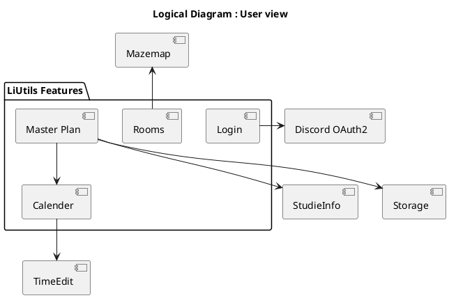
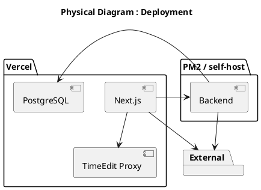
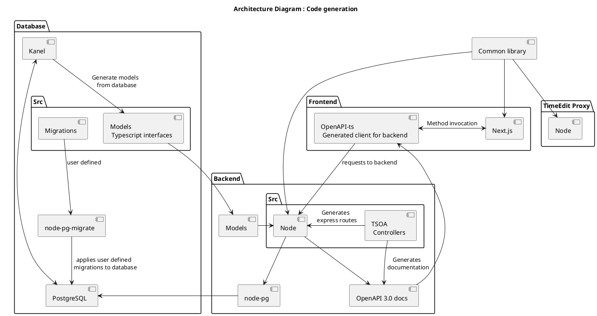
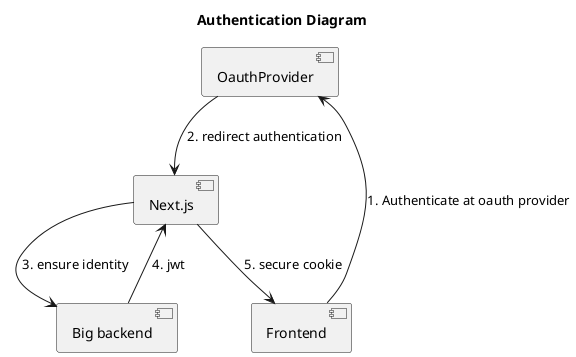
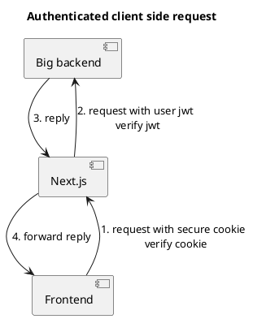

```plantuml
@startuml

title Logical Diagram : User view

package "LiUtils Features" {
    [Rooms] as r
    [Master Plan] as m
    [Calender] as c
    [Login] as l
}

[Mazemap] as map
r -u-> map
[Discord OAuth2] as discord

l -r-> discord

[StudieInfo] as s
[TimeEdit] as te
[Storage] as db

m --> db
m --> s

m --> c
c --> te

@enduml

```

```plantuml
@startuml

title Physical Diagram : Deployment

package "Vercel" {
    [Next.js] as next
    [TimeEdit Proxy] as te
    [PostgreSQL] as sql

}

package "PM2 / self-host" {
    [Backend] as be
}

package "External" {

}

next --> be
next --> te
next --> "External"
be --> "External"
be --> sql

@enduml

```

```plantuml
@startuml

title Architecture Diagram : Code generation

package "Database" {
    [PostgreSQL] as sql
    [Kanel] as kanel
    [node-pg-migrate] as migrate
    package "Src" {
        [Migrations] as migrations
        [Models \n Typescript interfaces] as models
    }

    migrations --> migrate : user defined
    migrate --> sql : applies user defined \n migrations to database

    kanel <-> sql
    kanel --> models : Generate models \n from database
}

[Common library] as common

package "Backend" {
    [node-pg] as nodepg
    [OpenAPI 3.0 docs] as docs
    [Models] as bemodels
    package [Src] as besrc {
        [Node] as be
        [TSOA \n Controllers] as tsoa
    }

    tsoa -l-> be : Generates \n express routes
    tsoa -> docs : Generates \n documentation
    bemodels -r-> be
    be --> nodepg
    be --> docs
}

nodepg --> sql
models --> bemodels
common --> be

package "Frontend" {
    [Next.js] as next
    [OpenAPI-ts \n Generated client for backend] as client
    client <-> next : Method invocation
}

package "TimeEdit Proxy" {
    [Node] as te
}

common --> te

common --> next
client <- docs
client --> be : requests to backend


@enduml

```

## Scenarios

```plantuml
@startuml

title Authentication Diagram

[Big backend] as be

[Next.js] as next
[Frontend] as fe


[OauthProvider] as oauth

fe -u-> oauth : 1. Authenticate at oauth provider
oauth --> next : 2. redirect authentication
next --> be : 3. ensure identity
be --> next : 4. jwt
next --> fe : 5. secure cookie

@enduml

```

```plantuml
@startuml

title Authenticated client side request

[Big backend] as be

[Next.js] as next
[Frontend] as fe

fe -d-> next : 1. request with secure cookie \n verify cookie
next --> be : 2. request with user jwt \n verify jwt
be --> next : 3. reply
next --> fe : 4. forward reply

@enduml

```